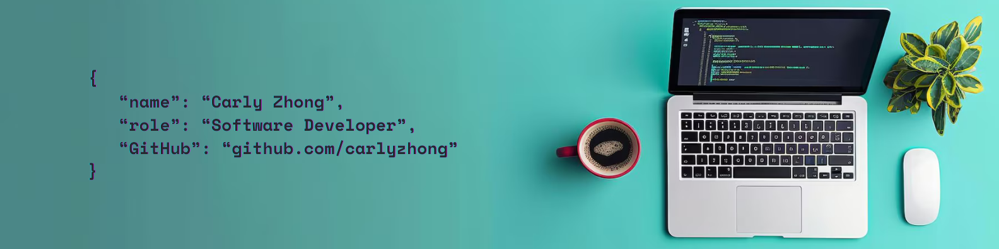

# 🌿 Carly Zhong | Becoming a Software Developer with passion🌟

Hi There! I'm Carly — a former accountant turned software developer, currently completing the Northcoders bootcamp. I'm passionate about building clean, purposeful code and bringing joy to learning through side projects inspired by nature and creativity.  
 

🔧 **Tech Stack:**  
JavaScript · Node.js · Express · PostgreSQL · HTML · CSS · Git · Jest · Supabase · Render

🌱 **Currently learning:**  
TypeScript · C# · .NET · React · Python · SQL

🐾 **Side Projects:**

- 🌱 Rare Plant Collector App - a plant-themed app inspired by Pokémon card mechanics
- 🐶 [AC's Instagram](https://www.instagram.com/acthepomx/) – just a dog with with endless love and treats

📚 **Recent Achievement:**  
Deployed my first Reddit-style RESTful API with full testing and robust error handling  
→ [GitHub Repo](https://github.com/carlyzhong/DevDialogue-API) · [Live Demo](https://nc-news-ya2m.onrender.com)

💬 **Ask me about:**  
Career-switching into tech · Walking trails near me · Mental health & sustainability in work · Tropical Plant care tips

📩 **Let's Connect!**  
📧 [Email Me](zhongyjcarly@gmail.com)  
📘 [Linkedin](https://www.linkedin.com/in/carlyzhong/)

📍 Manchester, UK

---
